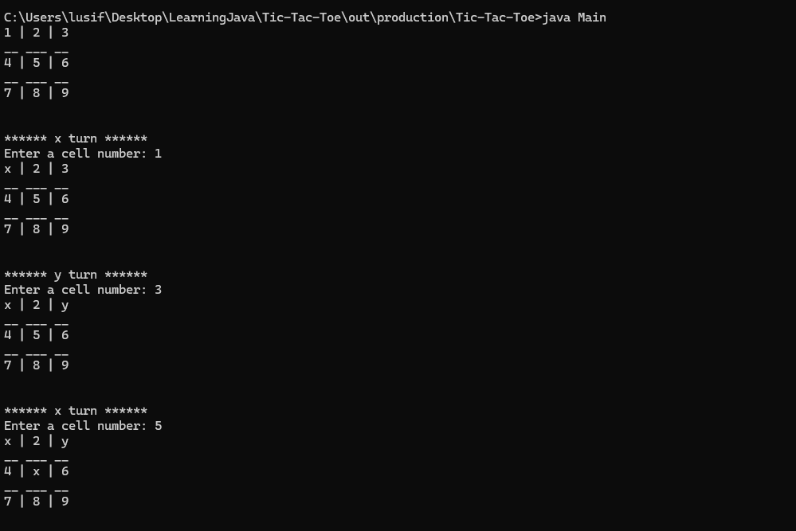
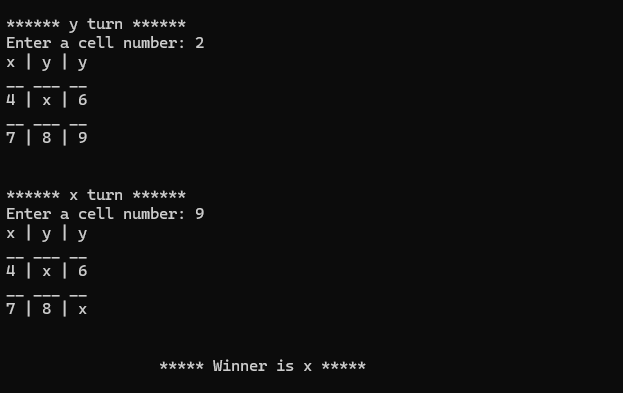

# Simple Multiplayer _Tic-Tac-Toe_ in java

From the past 2 weeks, I am learning JAVA programming language and
after covering all the basics I thought of making an simple project in this language,
and I decided to build our childhood favorite game, Tic-Tac-Toe.

I have build basic functionalities in the game, like checking winner, 
putting character to grid etc.

## Usage
**You must have installed jdk-v17**
1. Clone the repo.
2. Open in IntelliJ and run.
or
3. cd to out/production/Tic-Tac-Toe.
4. open cmd here and run -> `java Main`
5. Enjoy the game

## Screenshots

**Screenshot 1**

**Screenshot 2**

